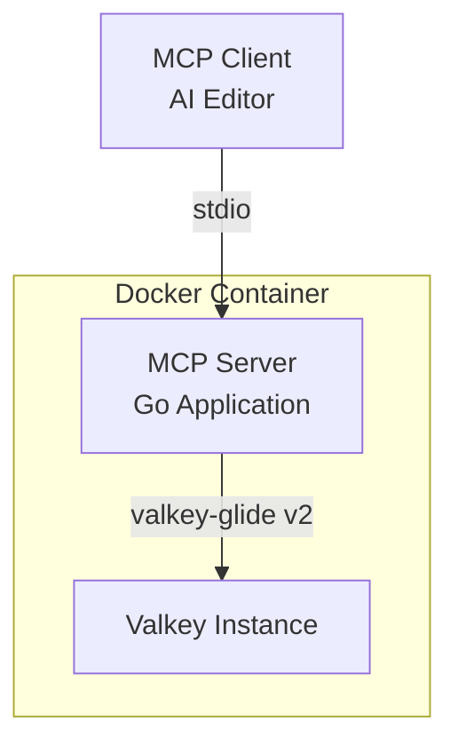
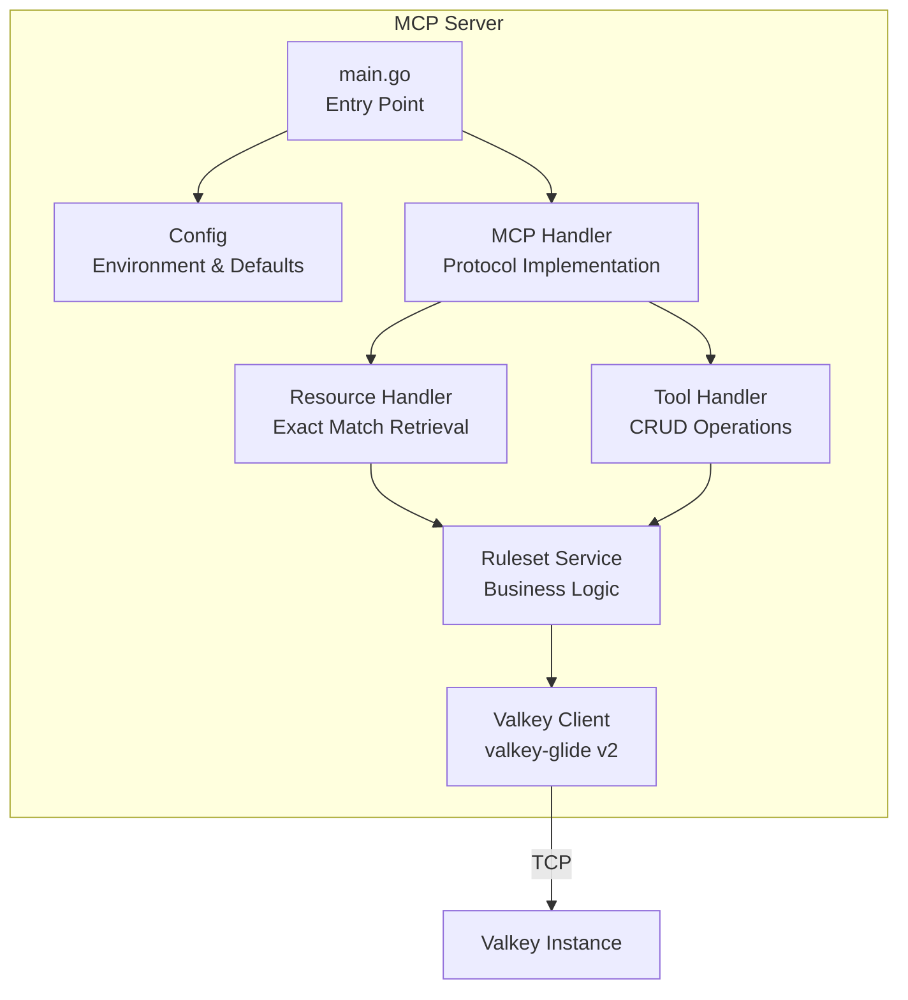
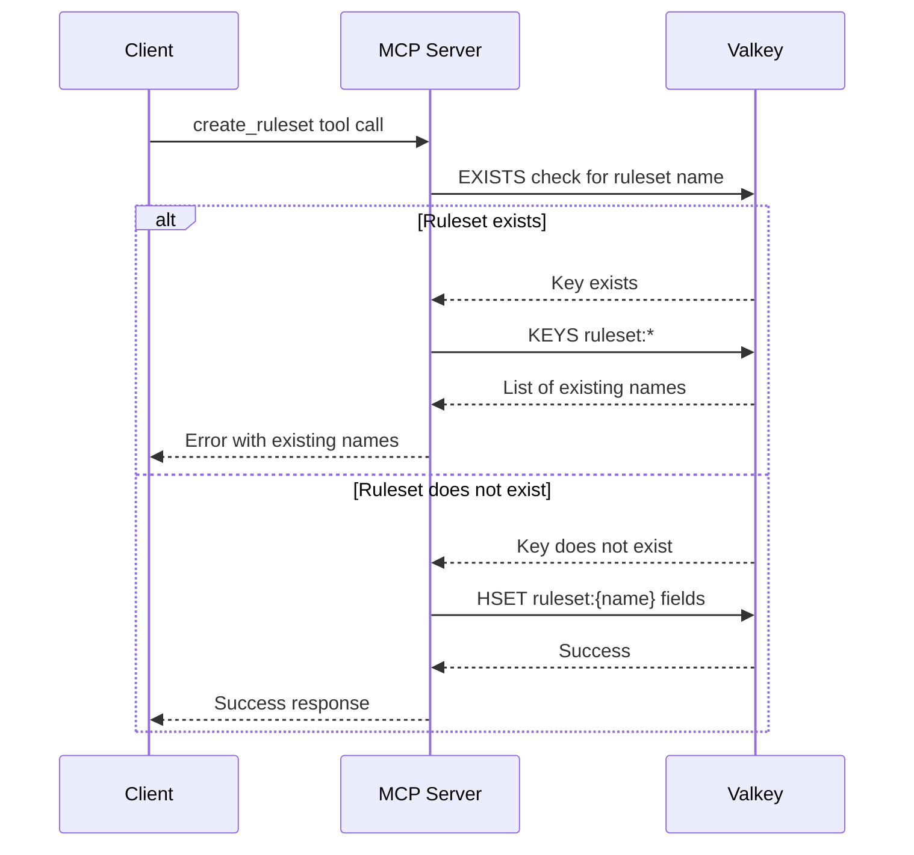
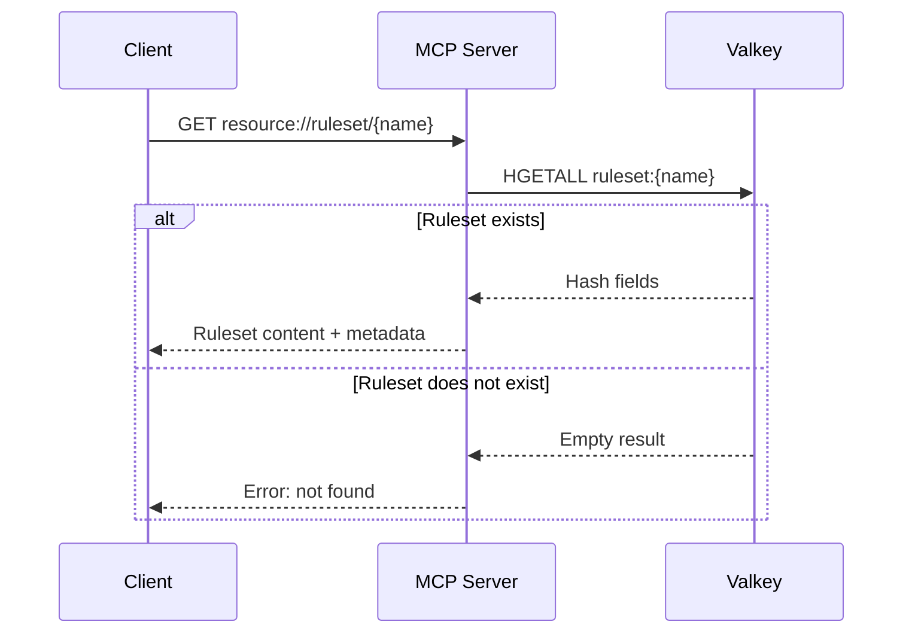

# Design Document

## Overview

The MCP Ruleset Server is a Go-based application that implements the Model Context Protocol (MCP) to provide centralized storage and management of AI editor rulesets. The server uses Valkey as its backing store and communicates with clients via stdio transport. The system will be distributed as a self-contained Docker image based on Alpine Linux with a bundled Valkey instance.

### Key Design Principles

- **Simplicity**: Focus on core CRUD operations without over-engineering for scale
- **Standards Compliance**: Strict adherence to MCP protocol specifications and conventional commits
- **Container-First**: All-in-one Docker image for easy deployment and portability
- **Minimal Configuration**: Sensible defaults with environment variable overrides

## Architecture

### High-Level Architecture



### Component Architecture



### Data Flow

**Create Ruleset Flow:**



**Retrieve Ruleset Flow (Resource):**



## Components and Interfaces

### 1. Main Entry Point (`cmd/mcp-ruleset-server/main.go`)

**Responsibilities:**

- Parse command-line flags and environment variables
- Initialize Valkey connection
- Set up MCP server with stdio transport
- Handle graceful shutdown

**Configuration:**

- `VALKEY_HOST`: Valkey host address (default: "localhost")
- `VALKEY_PORT`: Valkey port (default: "6379")
- `LOG_LEVEL`: Logging verbosity (default: "info")

### 2. Configuration Package (`internal/config`)

**Type: Config**

```go
type Config struct {
    ValkeyHost string
    ValkeyPort string
    LogLevel   string
}
```

**Functions:**

- `LoadConfig() (*Config, error)`: Load configuration from environment with defaults
- `Validate() error`: Validate configuration values

### 3. Valkey Client Package (`internal/valkey`)

**Type: Client**

```go
type Client struct {
    glideClient *glide.GlideClient
}
```

**Functions:**

- `NewClient(host, port string) (*Client, error)`: Create and connect Valkey client
- `Close() error`: Close Valkey connection
- `Ping() error`: Health check

### 4. Ruleset Service Package (`internal/ruleset`)

**Type: Ruleset**

```go
type Ruleset struct {
    Name         string    `json:"name"`
    Description  string    `json:"description"`
    Tags         []string  `json:"tags"`
    Markdown     string    `json:"markdown"`
    CreatedAt    time.Time `json:"created_at"`
    LastModified time.Time `json:"last_modified"`
}
```

**Type: Service**

```go
type Service struct {
    valkeyClient *valkey.Client
}
```

**Functions:**

- `NewService(client *valkey.Client) *Service`: Create service instance
- `Create(ruleset *Ruleset) error`: Create new ruleset
- `Get(name string) (*Ruleset, error)`: Retrieve ruleset by exact name
- `Update(name string, updates *RulesetUpdate) error`: Update existing ruleset
- `Delete(name string) error`: Delete ruleset
- `List() ([]*Ruleset, error)`: List all rulesets
- `Search(pattern string) ([]*Ruleset, error)`: Search rulesets by pattern
- `Exists(name string) (bool, error)`: Check if ruleset exists
- `ListNames() ([]string, error)`: Get all ruleset names

**Valkey Key Schema:**

- Key pattern: `ruleset:{name}` (e.g., `ruleset:python_style_guide`)
- Data structure: Hash
- Hash fields:
  - `description`: String
  - `tags`: JSON-encoded string array
  - `markdown`: String (ruleset content)
  - `created_at`: RFC3339 timestamp
  - `last_modified`: RFC3339 timestamp

### 5. MCP Handler Package (`internal/mcp`)

**Type: Handler**

```go
type Handler struct {
    rulesetService *ruleset.Service
    server         *mcpgolang.MCPServer
}
```

**Functions:**

- `NewHandler(service *ruleset.Service) *Handler`: Create MCP handler
- `RegisterResources()`: Register ruleset resources
- `RegisterTools()`: Register CRUD tools
- `Start() error`: Start MCP server with stdio transport

**MCP Resources:**

- URI scheme: `ruleset://{name}`
- MIME type: `text/markdown`
- Description: "AI editor ruleset: {description}"

**MCP Tools:**

1. **create_ruleset**
   - Description: "Create a new ruleset with metadata and content"
   - Parameters:
     - `name` (string, required): Snake_case ruleset name
     - `description` (string, required): Brief description
     - `tags` (array of strings, optional): Categorization tags
     - `markdown` (string, required): Ruleset content in markdown
   - Returns: Success message or error with existing names

2. **get_ruleset**
   - Description: "Retrieve a ruleset by exact name"
   - Parameters:
     - `name` (string, required): Exact ruleset name
   - Returns: Complete ruleset with metadata

3. **update_ruleset**
   - Description: "Update an existing ruleset"
   - Parameters:
     - `name` (string, required): Ruleset name to update
     - `description` (string, optional): New description
     - `tags` (array of strings, optional): New tags
     - `markdown` (string, optional): New content
   - Returns: Success message or error

4. **delete_ruleset**
   - Description: "Delete a ruleset by name"
   - Parameters:
     - `name` (string, required): Ruleset name to delete
   - Returns: Success message or error with existing names

5. **list_rulesets**
   - Description: "List all available rulesets"
   - Parameters: None
   - Returns: Array of rulesets with metadata (excluding markdown content)

6. **search_rulesets**
   - Description: "Search rulesets by name pattern"
   - Parameters:
     - `pattern` (string, required): Glob pattern (e.g., "*python*", "style_*")
   - Returns: Array of matching rulesets with metadata

### 6. Utilities Package (`internal/util`)

**Functions:**

- `ValidateRulesetName(name string) error`: Validate snake_case naming
- `MatchPattern(pattern, text string) bool`: Glob pattern matching
- `FormatTimestamp(t time.Time) string`: RFC3339 formatting
- `ParseTimestamp(s string) (time.Time, error)`: RFC3339 parsing

## Data Models

### Ruleset Storage in Valkey

Each ruleset is stored as a Valkey hash with the following structure:

```
Key: ruleset:python_style_guide
Hash Fields:
  description: "Python coding style guidelines for team projects"
  tags: ["python", "style", "pep8"]
  markdown: "# Python Style Guide\n\n## Naming Conventions\n..."
  created_at: "2025-10-28T10:30:00Z"
  last_modified: "2025-10-28T15:45:00Z"
```

### Index for Pattern Matching

For efficient pattern matching and listing, we'll use Valkey's `KEYS` or `SCAN` commands with the pattern `ruleset:*`. Given the expected scale (couple dozen rulesets), `KEYS` is acceptable.

## Error Handling

### Error Categories

1. **Validation Errors**: Invalid input (malformed names, missing required fields)
2. **Conflict Errors**: Duplicate names on create, non-existent names on update/delete
3. **Connection Errors**: Valkey connection failures
4. **Protocol Errors**: MCP protocol violations

### Error Response Format

All errors will be returned as MCP error responses with:

- Error code (following MCP error code conventions)
- Human-readable message
- Additional context (e.g., list of existing names for conflicts)

### Specific Error Scenarios

**Create with Existing Name:**

```json
{
  "error": {
    "code": -32602,
    "message": "Ruleset 'python_style_guide' already exists. Please choose a different name.",
    "data": {
      "existing_rulesets": ["python_style_guide", "javascript_rules", "go_conventions"]
    }
  }
}
```

**Delete Non-Existent Ruleset:**

```json
{
  "error": {
    "code": -32602,
    "message": "Ruleset 'nonexistent_rule' not found.",
    "data": {
      "existing_rulesets": ["python_style_guide", "javascript_rules", "go_conventions"]
    }
  }
}
```

**Valkey Connection Failure:**

```json
{
  "error": {
    "code": -32603,
    "message": "Failed to connect to Valkey: connection refused",
    "data": {
      "host": "localhost",
      "port": "6379"
    }
  }
}
```

## Docker Container Design

### Multi-Stage Dockerfile

```dockerfile
# Stage 1: Build Go application
FROM golang:1.21-alpine AS builder
# ... build steps ...

# Stage 2: Runtime image
FROM alpine:latest
# Install Valkey
# Copy Go binary
# Setup entrypoint script
```

### Container Startup Sequence

1. Start Valkey in background
2. Wait for Valkey to be ready (health check)
3. Start MCP server with stdio
4. Handle shutdown signals gracefully

### Entrypoint Script (`docker-entrypoint.sh`)

```bash
#!/bin/sh
# Start Valkey
valkey-server --daemonize yes

# Wait for Valkey
until valkey-cli ping; do
  sleep 1
done

# Start MCP server
exec /usr/local/bin/mcp-ruleset-server
```

### Volume Mounts

- `/data`: Valkey data persistence (optional)

### Environment Variables

- `VALKEY_HOST`: Default "localhost" (internal)
- `VALKEY_PORT`: Default "6379"
- `LOG_LEVEL`: Default "info"

## Testing Strategy

### Unit Tests

**Package: internal/config**

- Test configuration loading with various environment variables
- Test default value application
- Test validation logic

**Package: internal/ruleset**

- Test ruleset CRUD operations with mock Valkey client
- Test name validation
- Test pattern matching
- Test timestamp handling
- Test error scenarios (duplicates, not found)

**Package: internal/util**

- Test snake_case validation
- Test glob pattern matching
- Test timestamp formatting/parsing

### Integration Tests

**Valkey Integration**

- Test actual Valkey operations using testcontainers
- Test connection handling and retries
- Test data persistence and retrieval
- Test concurrent operations

**MCP Protocol Integration**

- Test tool invocations with sample payloads
- Test resource retrieval
- Test error responses
- Test stdio transport

### End-to-End Tests

**Docker Container Tests**

- Test container startup and Valkey initialization
- Test MCP server availability
- Test full CRUD workflow through stdio
- Test graceful shutdown

### Test Coverage Goals

- Minimum 80% code coverage for core packages
- 100% coverage for critical paths (create, update, delete)
- All error paths must be tested

## CI/CD Pipeline Design

### Continuous Integration Workflow

**Trigger:** Pull requests and pushes to main

**Steps:**

1. Checkout code
2. Setup Go environment (1.21+)
3. Install dependencies
4. Run linters (golangci-lint)
5. Run unit tests with coverage
6. Run integration tests
7. Build Docker image
8. Run container smoke tests
9. Upload coverage reports

**Tools:**

- golangci-lint for code quality
- go test with race detector
- testcontainers for integration tests

### Continuous Deployment Workflow

**Trigger:** Manual workflow dispatch

**Steps:**

1. Checkout code
2. Run semantic-release
   - Analyze commits (conventional commits)
   - Determine next version
   - Generate changelog
   - Create Git tag
3. Build multi-arch Docker images (amd64, arm64)
4. Push images to registry with tags:
   - `latest`
   - `v{major}.{minor}.{patch}`
   - `v{major}.{minor}`
   - `v{major}`
5. Create GitHub release with:
   - Generated changelog
   - Docker image references
   - Usage instructions

**Semantic Release Configuration:**

- Commit analyzer: conventional commits
- Release notes generator: based on commit types
- Changelog: CHANGELOG.md
- Git assets: package.json (for version tracking)

### Commit Message Enforcement

**Pre-commit Hook (optional):**

- Validate commit message format
- Ensure conventional commit compliance

**CI Validation:**

- Check all commits in PR follow conventional commits
- Fail CI if non-compliant commits detected

**Conventional Commit Types:**

- `feat`: New features
- `fix`: Bug fixes
- `docs`: Documentation changes
- `chore`: Maintenance tasks
- `test`: Test additions/modifications
- `refactor`: Code refactoring
- `ci`: CI/CD changes

## Project Structure

```
mcp-ruleset-server/
├── cmd/
│   └── mcp-ruleset-server/
│       └── main.go
├── internal/
│   ├── config/
│   │   ├── config.go
│   │   └── config_test.go
│   ├── valkey/
│   │   ├── client.go
│   │   └── client_test.go
│   ├── ruleset/
│   │   ├── service.go
│   │   ├── service_test.go
│   │   └── types.go
│   ├── mcp/
│   │   ├── handler.go
│   │   ├── handler_test.go
│   │   ├── resources.go
│   │   └── tools.go
│   └── util/
│       ├── validation.go
│       ├── validation_test.go
│       └── patterns.go
├── test/
│   ├── integration/
│   │   ├── valkey_test.go
│   │   └── mcp_test.go
│   └── e2e/
│       └── docker_test.go
├── docker/
│   ├── Dockerfile
│   └── docker-entrypoint.sh
├── .github/
│   └── workflows/
│       ├── ci.yml
│       └── cd.yml
├── examples/
│   ├── mcp-config.json
│   └── sample-rulesets/
│       ├── python_style.md
│       └── go_conventions.md
├── docs/
│   ├── ARCHITECTURE.md
│   └── API.md
├── go.mod
├── go.sum
├── .releaserc.json
├── .golangci.yml
├── README.md
├── CONTRIBUTING.md
├── LICENSE
└── CHANGELOG.md
```

## Dependencies

### Go Modules

- `github.com/valkey-io/valkey-glide/go/v2`: Valkey client library
- `github.com/mark3labs/mcp-go`: MCP protocol implementation
- `github.com/spf13/viper`: Configuration management (optional)
- `github.com/rs/zerolog`: Structured logging
- `github.com/stretchr/testify`: Testing utilities
- `github.com/testcontainers/testcontainers-go`: Integration testing

### System Dependencies (Docker)

- Alpine Linux base image
- Valkey server (latest stable)

## Security Considerations

### Current Scope (V1)

- No authentication/authorization (stdio transport is local)
- No TLS (local Valkey connection)
- No credential management

### Future Considerations

- Add authentication when supporting network transports
- Implement access control for multi-user scenarios
- Add encryption for sensitive rulesets
- Audit logging for compliance

## Performance Considerations

### Expected Scale

- Maximum 100 rulesets (design target: couple dozen)
- Average ruleset size: 10-50 KB
- Concurrent operations: Low (single user, stdio)

### Optimization Strategies

- Use Valkey hashes for efficient field access
- Implement connection pooling (valkey-glide handles this)
- Cache frequently accessed rulesets in memory (future optimization)
- Use SCAN instead of KEYS for large datasets (future optimization)

### Resource Limits

- Docker container: 256 MB RAM, 0.5 CPU (recommended)
- Valkey: 128 MB max memory with LRU eviction (future configuration)

## Monitoring and Observability

### Logging

- Structured JSON logs using zerolog
- Log levels: debug, info, warn, error
- Key log events:
  - Server startup/shutdown
  - Valkey connection status
  - Tool invocations
  - Errors and warnings

### Metrics (Future)

- Tool invocation counts
- Operation latencies
- Valkey connection health
- Error rates

### Health Checks

- Valkey ping on startup
- Periodic health checks (future)
- Graceful degradation on Valkey unavailability

## Documentation Plan

### README.md

- Project overview and motivation
- Quick start guide
- Docker usage instructions
- MCP client configuration examples
- Development setup

### CONTRIBUTING.md

- Conventional commit guidelines
- Development workflow
- Testing requirements
- PR process

### API.md

- Complete MCP tool reference
- Resource URI schemes
- Request/response examples
- Error codes and handling

### ARCHITECTURE.md

- Detailed component descriptions
- Data flow diagrams
- Design decisions and rationale
- Extension points for future features
